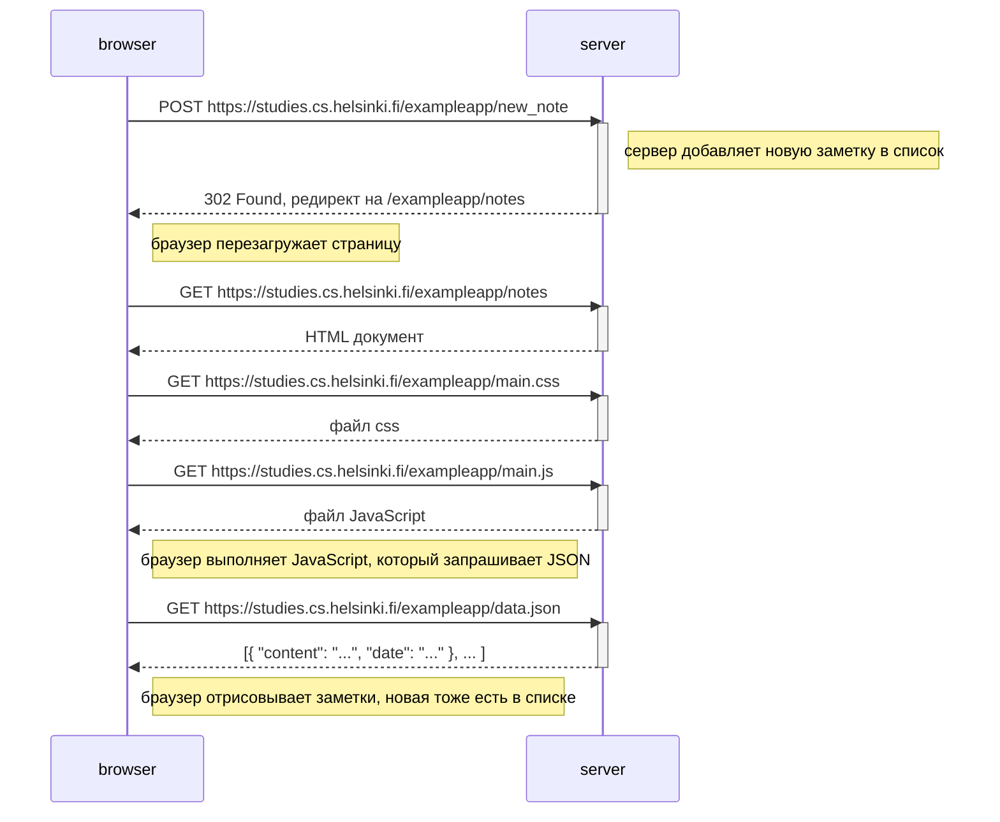

# 0.4 Новая заметка

Пользователь пишет текст в поле на странице https://studies.cs.helsinki.fi/exampleapp/notes и нажимает Save.

```mermaid
sequenceDiagram
    participant browser
    participant server

    browser->>server: POST https://studies.cs.helsinki.fi/exampleapp/new_note
    activate server
    Note right of server: сервер добавляет новую заметку в список
    server-->>browser: 302 Found, редирект на /exampleapp/notes
    deactivate server

    Note right of browser: браузер перезагружает страницу

    browser->>server: GET https://studies.cs.helsinki.fi/exampleapp/notes
    activate server
    server-->>browser: HTML документ
    deactivate server

    browser->>server: GET https://studies.cs.helsinki.fi/exampleapp/main.css
    activate server
    server-->>browser: файл css
    deactivate server

    browser->>server: GET https://studies.cs.helsinki.fi/exampleapp/main.js
    activate server
    server-->>browser: файл JavaScript
    deactivate server

    Note right of browser: браузер выполняет JavaScript, который запрашивает JSON

    browser->>server: GET https://studies.cs.helsinki.fi/exampleapp/data.json
    activate server
    server-->>browser: [{ "content": "...", "date": "..." }, ... ]
    deactivate server

    Note right of browser: браузер отрисовывает заметки, новая тоже есть в списке
```
