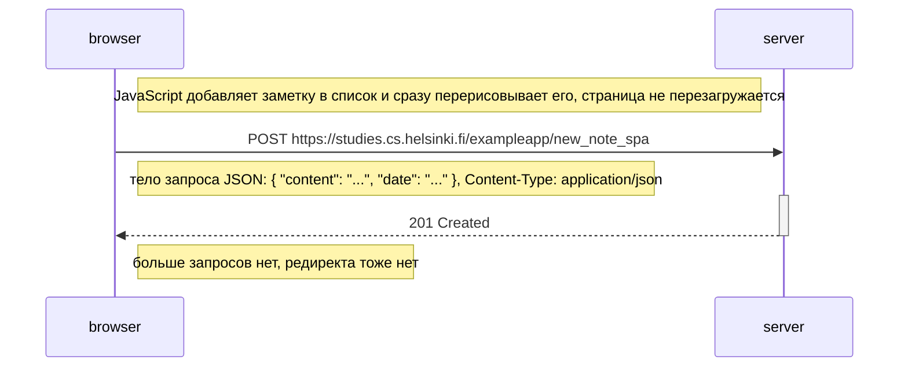

# 0.6 Новая заметка в одностраничном приложении

Пользователь пишет заметку на странице https://studies.cs.helsinki.fi/exampleapp/spa и нажимает Save.

```mermaid
sequenceDiagram
    participant browser
    participant server

    Note right of browser: JavaScript добавляет заметку в список и сразу перерисовывает его, страница не перезагружается

    browser->>server: POST https://studies.cs.helsinki.fi/exampleapp/new_note_spa
    Note right of browser: тело запроса JSON: { "content": "...", "date": "..." }, Content-Type: application/json
    activate server
    server-->>browser: 201 Created
    deactivate server

    Note right of browser: больше запросов нет, редиректа тоже нет
```
